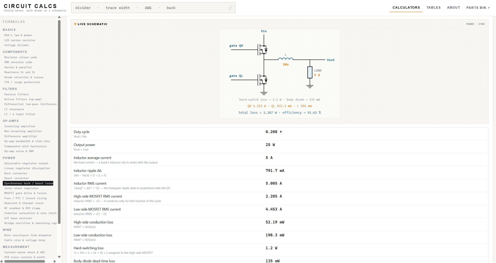
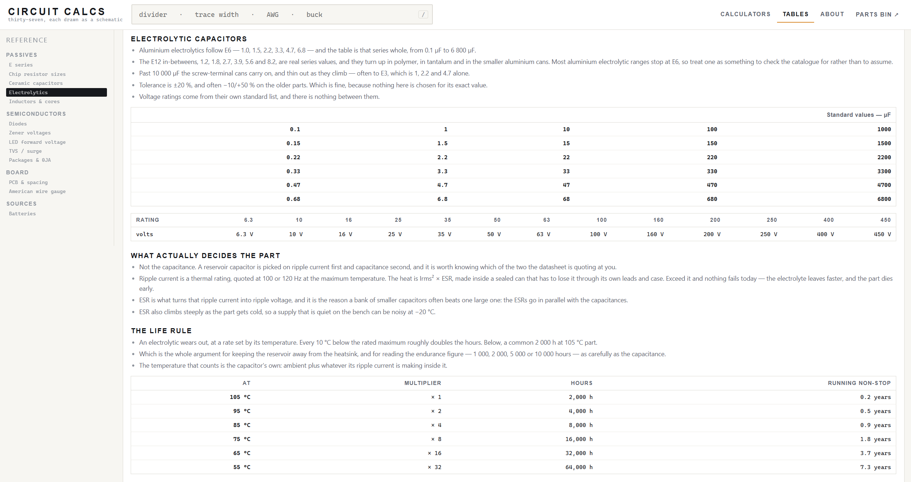
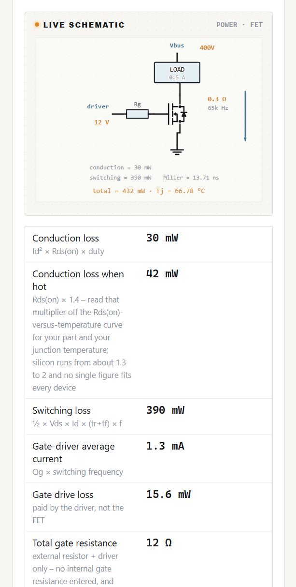

# Circuit Calcs

Forty-one bench calculators in a single HTML file. Each one draws the circuit it is describing,
and the drawing redraws as you type.

**[Open it →](https://ajengineering.github.io/circuit-calcs/)**



*Every figure carries the relation that produced it, underneath the number.*

No server, no build step, no dependencies, no account, nothing to install. Download `calc.html`,
open it in a browser, and it works — off a disk, off a USB stick, or from wherever you serve it.
The page loads nothing external and makes no network request at all, so it works with the wire
pulled out and will keep working long after anyone stops maintaining it.

## What is in it

| Group | Calculators |
|---|---|
| Basics | Ohm's law & power · voltage divider, loaded or not · LED series resistor |
| Components | Resistor colour code · SMD resistor code · series & parallel · reactance Xc and XL · TVS / surge protection · diode selection & losses |
| Filters | Passive RC/RL/RLC filters · active op-amp filters · differential low-pass on a difference amp · LC resonance · LC / π input filter |
| Op-amps | Inverting · non-inverting · difference · comparator with hysteresis · bandwidth & slew rate · noise & SNR |
| Power | Adjustable regulator · linear regulator dissipation · buck · boost · synchronous buck / boost losses · zener shunt · BJT base resistor · bridge rectifier, transformer & smoothing · MOSFET gate drive & losses · RC snubber & RCD clamp · inductor saturation & core check · fuse / PTC / inrush · heatsink & thermal stack |
| Wire | Wire resistance from diameter · cable size & voltage drop |
| Measurement | Current-sense shunt & ADC · ADC input front-end · NTC, PT100 & RTD · I²C pull-up & bus capacitance · PCB trace current & width · battery runtime |

## Engineering notation, in and out

Type `4k7`, `100n`, `10u`, `1M`. A letter may stand in for the decimal point, the way it does on a
schematic. **Input is case sensitive on purpose: `M` is mega and `m` is milli.**

Every calculator opens with figures already in it, so you can see what it does before typing
anything. The unit each field expects is written beside it, and stating the unit is optional.

## The Tables tab

A tab of its own, holding the standard values, sizes and codes the calculators are built around.
One section at a time, picked from the rail, grouped the same way the calculators are. They live in one
place rather than scattered under the calculators, so there is nothing to hunt for, and each
calculator with a table behind it carries a one-line link straight to its section.



| Section | What it holds |
|---|---|
| E series | One decade of E24, with the E12 and E6 values marked inside it, and the tolerance each series carries. |
| Chip resistor sizes | Imperial and metric, outline in mm, the usual thick-film power rating, maximum working voltage — and the resistance above which the volts bind before the watts do. |
| Ceramic capacitors | Standard values with their three-digit markings, the tolerance letters, and the dielectric codes with what each is for. |
| Electrolytics | Values and voltage ratings, ripple current and ESR, the families, and the life rule. |
| Inductors & cores | Standard values and markings, and the core materials — permeability, Bsat, and whether the knee is hard or soft. |
| Diodes | The 1N400x and 1N540x families, the Schottky and small-signal parts, and forward drop by type. |
| Zener voltages | The standard voltages with their 1N47xx parts, and why the middle of the range is the good part. |
| LED forward voltage | Vf by colour, with the die that sets it. |
| TVS / surge | Standard stand-off voltages, the families and their ratings, and the three voltages in order. |
| Packages & θJA | SC-70 to TO-247: outline, θJA on the datasheet’s own board, and θJC where the package has a tab. |
| PCB & spacing | Laminates with Dk, Df and Tg; copper weights and board thicknesses; and what actually indexes a clearance table. |
| American wire gauge | Diameter, cross-section and Ω/m. |
| Batteries | Cell voltages full to empty, the size-is-the-number rule, and what a capacity figure is quoted at. |

Each section has its own address — `#tables-elec`, `#tables-zeners` — so one can be sent to
somebody on its own.

The clearance and creepage part is deliberately incomplete: the page explains what indexes those
tables — working voltage, internal or external, coated or not, pollution degree, material group —
and then sends you to IPC-2221B Table 6-1 and IEC 60664-1 rather than reprinting millimetres it
cannot verify. A safety figure remembered wrongly would be believed on a mains board.

Three sections exist mostly to head off a mistake. Metric **0402** is imperial **01005** and imperial
**0402** is metric **1005** — two sizes apart, one number. A green LED is either a 2.1 V GaP part
or a 3.2 V InGaN one, which is the difference between a resistor that works and one that does not.
And an electrolytic wears out on a clock set by its own temperature: every 10 °C below the rating
roughly doubles the hours it lasts.

## Where the numbers stop

The cable calculator sizes a run for an allowed drop, reports the voltage actually reaching the
load, and asks for the conductor temperature rather than assuming 20 °C — copper gains 0.39 % per
degree and a loaded cable is not cold. It gives watts per metre and refuses to print a temperature
rise, because that depends on insulation, bundling and ambient air.

For the same reason the AWG table carries diameter, cross-section and Ω/m and no current rating. A
number invented there would be believed. The tables above are written the same way: where a figure
is a class of parts rather than a part, it is given as a range and said to be one — core materials,
LED forward voltages, the power rating of a chip size. The datasheet in front of you governs.

## Linking to one

Every calculator has its own address, so one can be kept in a tab or sent to someone:

```
https://ajengineering.github.io/circuit-calcs/calc.html#trace
https://ajengineering.github.io/circuit-calcs/calc.html#cable
```

The id is the one in the search box results — `ohm`, `divider`, `led`, `rcolor`, `smd`,
`netcombo`, `react`, `rc`, `lc`, `opinv`, `opnon`, `opdiff`, `hyst`, `opspeed`, `reg`, `ldo`, `buck`, `boost`,
`zener`, `bjt`, `rectifier`, `fet`, `snubber`, `inductor`, `heatsink`, `wire`, `cable`, `shunt`, `adc`, `tempsense`,
`i2c`, `trace`, `batt`, `lcinput`, `activefilter`, `difflp`, `tvs`.

`#about` opens the **About** tab, which carries the version, the licence, what the page keeps in
your browser, and why these calculators are a separate file from the inventory they came out of.

## Searching

The box at the top filters the list. It searches the names, the field labels and the units, so
`awg` finds the cable calculators and `eia96` finds the SMD code reader even though neither word
is in a title.

## On a phone



The rail folds away, the drawing scales with the page, and a wide table scrolls inside its own
panel rather than pushing the page sideways.

## What it remembers

The calculator you had open and what you typed into each, in that browser only, through
`localStorage`. Nothing is uploaded anywhere and there is no account. Clearing your browser data
clears it.

## Where it came from

These calculators were part of [Parts Bin](https://github.com/AJEngineering/parts-bin-app), a
component inventory in a single HTML file. They were split out because they are useful on their own
and because a third of that file was calculators — the suggestion came from
[abeyer on the EEVblog forum](https://www.eevblog.com/forum/projects/).

Parts Bin links here from its own toolbar. Nothing is loaded across: the link opens a tab, and each
page still works with no network at all.

## Tests

```
node test.js
```

No dependencies and nothing to install, because the page has none either. `test.js` pulls the
script out of `calc.html`, runs it under a small stub of a DOM, and then works on the parts that
return values rather than draw: the calculators’ `run()` functions, the diagram builders, and the
reference tables.

It checks that every calculator answers its own placeholder values without producing NaN, that
every result row says how it was worked out or is one of the few that should not, and that each
reference section builds with a heading and can scroll if it is wide. Then it draws **every option
of every dropdown** — 167 diagrams across 41 calculators — and measures each one for boxes that
overlap, wires that run through a part, labels crossed by a wire, and text outside the frame.

The rest are one test per fault that was actually found, named after it. A boost’s ESR ripple
following the peak current rather than the inductor ripple. Gate-drive loss counted against
efficiency but not against the junction temperature. A band-stop phase that is a small negative
angle below resonance and undefined at the notch. A bridge rectifier’s PIV being one secondary
peak and not two. The whole E6 series being present in the electrolytic table, after a hand-typed
list turned out to hold 33 and 330 but not 3.3.

Those exist because each of them was wrong once and nobody noticed by looking. The drawing checks
in particular found two more on the day they were written, in modes the page had never been opened
in: an axis label crossing its own axis, and a clamp capacitor’s name running under the resistor
branch beside it.

## Licence

MIT — free to use, change and redistribute, with attribution. See [LICENSE](LICENSE).
